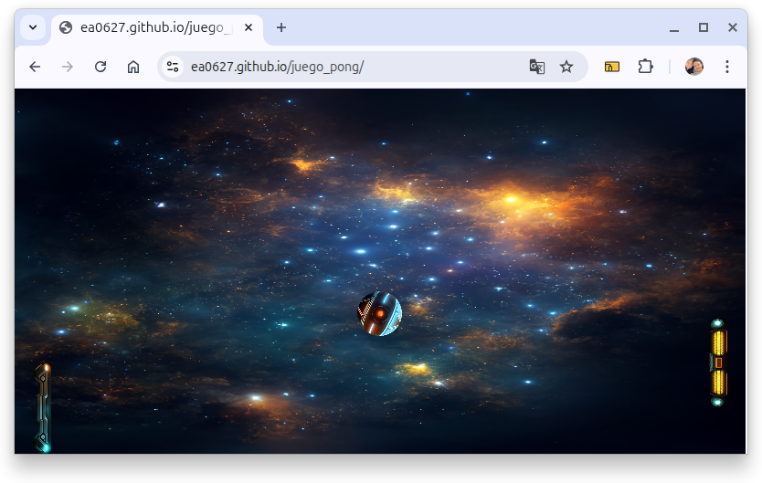

# 🎮 Pong Clásico con un Toque de IA

Bienvenido a mi versión del clásico juego Pong, con algunos giros modernos: un fondo personalizado, raquetas con estilo, efectos de sonido... ¡y un marcador narrado por voz! Todo desarrollado con el apoyo de **GitHub Copilot** y **ChatGPT**, como parte del curso:  
**"GitHub Copilot y ChatGPT: impulsa tu desarrollo con IA"** en [Alura Latam](https://www.aluracursos.com/).

## 🧠 Tecnologías y herramientas utilizadas

Este proyecto fue una excelente excusa para explorar cómo integrar la inteligencia artificial en el flujo de desarrollo. Durante su construcción, apliqué los siguientes aprendizajes:

- Uso de **GitHub Copilot** para generar código a partir de comentarios.
- Generación de estructuras base para juegos en canvas con IA.
- Refactorización de código asistida por **Copilot Labs**.
- Implementación de lógica de colisiones, movimiento y controles con Copilot como copiloto.
- Integración de **sprites personalizados** y mejora visual del entorno.
- Efectos de sonido y manejo de eventos del navegador (activación por clic).
- Narración del marcador usando la **Speech API** del navegador.

> ⚠️ A pesar del soporte de la IA, fue necesario ajustar y mejorar manualmente varias sugerencias. La IA ayuda, ¡pero tú eres el que manda!

## 🕹️ Cómo jugar

- **Control**: mueve la raqueta con el **mouse**.
- **Inicio**: haz **clic en la pantalla** para habilitar los sonidos y comenzar.
- **Objetivo**: que no se te pase la pelota. ¡Como en el Pong original!

## 🚀 ¿Cómo ejecutarlo?

Solo necesitas abrirlo en tu navegador favorito. No requiere instalación ni servidor local.  
Puedes probarlo ahora mismo haciendo clic aquí:

👉 [Jugar ahora en GitHub Pages](https://ea0627.github.io/juego_pong/)

### 🕹️ Juego en acción

## 👨‍💻 Autor

Creado por **Eduardo Amaya** como parte del curso de Alura Latam.  
- GitHub: [@ea0627](https://github.com/ea0627)  
- LinkedIn: [Eduardo Amaya](https://www.linkedin.com/in/eduardo-amaya-m/)

## 📄 Licencia

Este proyecto está bajo la licencia MIT. Siéntete libre de usarlo, adaptarlo o mejorarlo.

---

🎯 *La inteligencia artificial es una herramienta increíble, pero lo más importante es lo que tú como desarrollador haces con ella. Este juego es prueba de eso.*  
¡Gracias por visitar y jugar!